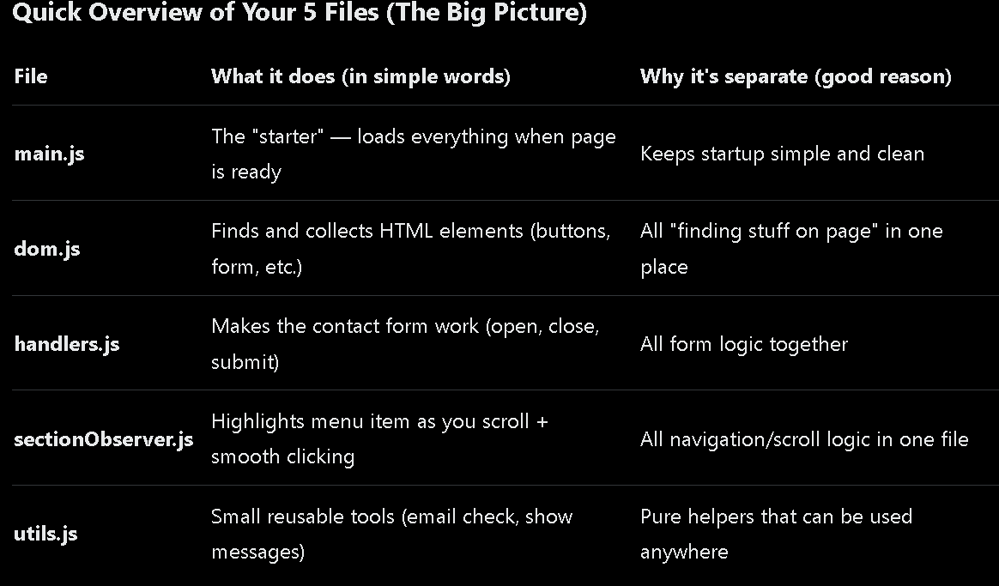

## What This Project Is (and Is Not)

This is a learning-focused project built to strengthen fundamentals and system thinking.
It is not a production application, and features are added deliberately as understanding improves.

# NAQSH | The Gathering

A full-stack web project inspired by a real hospitality space — focused on intentional gatherings, calm experiences, and clean system design.

This project is being built **in public** as part of a 100-day coding challenge to transition into a software developer role.

---

## 🚀 Why this project?

Most portfolio projects are abstract.

NAQSH is different:

- Inspired by a real resort context
- Designed with real users in mind
- Built with real constraints (time, clarity, scale)

The goal is not just to make things work — but to make them **readable, maintainable, and professional**.

---

## 🧠 What this project demonstrates

- Frontend architecture (modular JavaScript)
- Clean separation of concerns
- Responsive UI behavior
- Thoughtful refactoring
- Version control with Git
- Product thinking (user flow → system design)

---

## 🧩 Current Features

- Navigation with scroll-based active states
- Smooth section navigation
- Contact form with validation
- Modular JavaScript structure
- CSS variables for scalable design
- Clean Git history

---

## 🛠️ Tech Stack (current)

- HTML
- CSS (with variables)
- Vanilla JavaScript
- Git & GitHub

---

## 🔮 Planned (Next Phase)

- Backend (Node.js + Express)
- Form submission handling
- Database integration
- Admin dashboard
- Authentication
- Deployment

---

## 📅 Build Log

This project is documented daily through a 100-day vlog series, focusing on:

- Real learning
- Honest struggles
- Incremental progress

---

## 🙋‍♂️ About Me

I’m transitioning into software development and using this project to learn how real-world systems are built, maintained, and improved over time.

